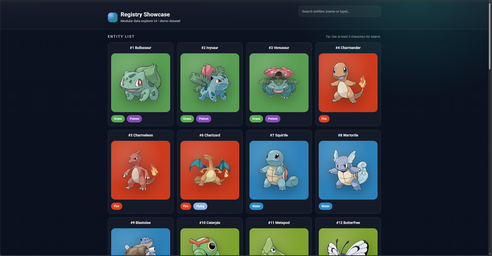
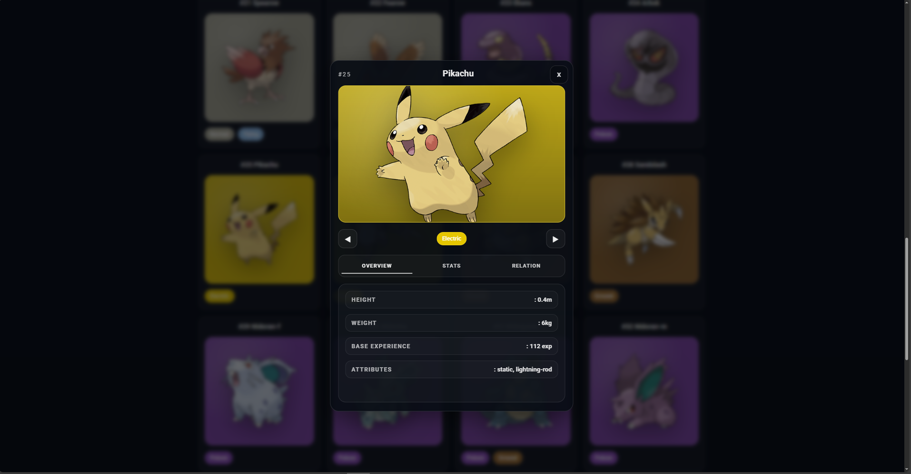
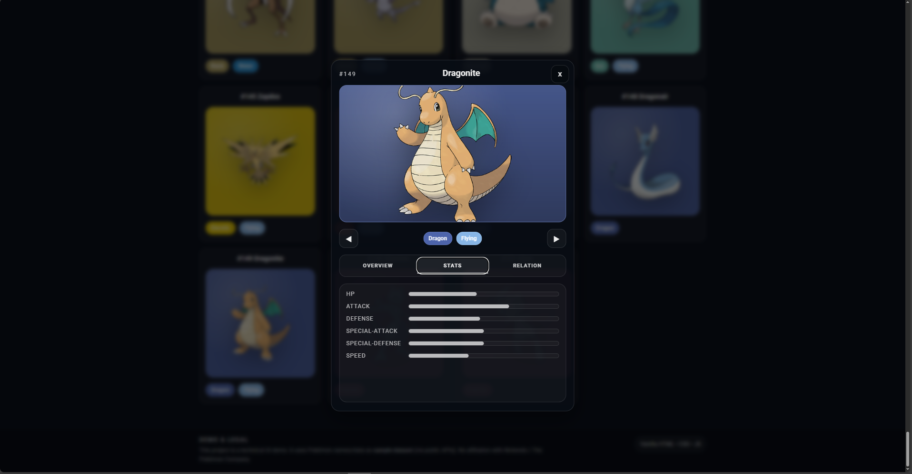
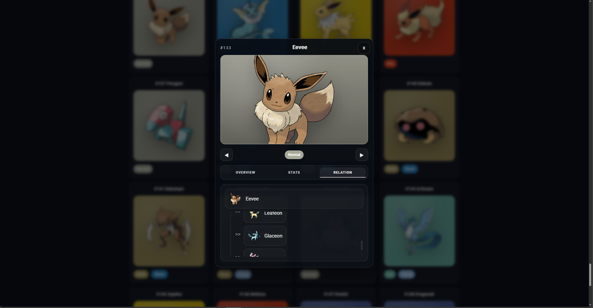

# Modular API-Driven Frontend Architecture

## Overview
This project demonstrates a modular, API-driven frontend architecture designed for scalable and reusable data interfaces.
The system separates data handling from UI components, allowing different REST APIs to be integrated without modifying core interface logic.

## Architecture Principles
- Clear separation between structure, styling, and logic
- Decoupled data mapping layer
- Modular component structure
- Dynamic data rendering
- Reusable dialog and filtering systems

## Technology Stack
-HTML
-CSS
-JavaScript

No external frameworks or backend services are used. The focus lies entirely on frontend architecture and structural design.

## Use Cases
The architectural approach is suitable for:
- Data dashboards
- Admin interfaces
- API-driven web applications
- Structured content systems

## Notes
This project demonstrates architectural structure only.
Displayed datasets are used for demonstration purposes.

## License:
- MIT License

## Screenshots:

